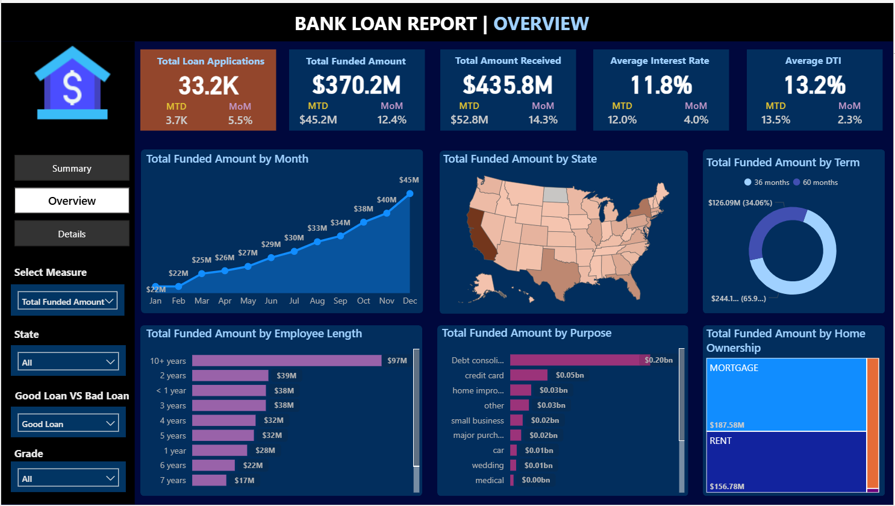

# 💼 Financial Loan Analysis Dashboard | Power BI + SQL

A Power BI dashboard that analyzes a real-world-like loan dataset with detailed financial, demographic, and credit information. This project uncovers trends in loan performance, borrower risk, interest rates, and default patterns using interactive KPI cards, charts, and slicers. It uses SQL queries to verify all the dax used.
---

## 📌 Table of Contents
- [Project Overview](#project-overview)
- [Live Dashboard Link](#live-dashboard-link)
- [Dataset](#dataset)
- [Key Features](#key-features)
- [Technologies Used](#technologies-used)
- [Insights Generated](#insights-generated)
- [Screenshots](#screenshots)
- [How to Run Locally](#how-to-run-locally)
- [Contact](#contact)

---

## 📝 Project Overview

This dashboard is designed for financial analysts and decision-makers in lending institutions. It helps evaluate borrower risk, identify trends in defaults, compare performance across states, and understand how variables like income, interest rate, or employment history affect loan outcomes.

Power Query (M) is used for data transformation, and DAX is used to build calculated KPIs.

---

## 🌐 Live Dashboard Link

👉 [Click here to view the live Power BI dashboard](https://app.powerbi.com/view?r=eyJrIjoiODk5ZDUxYTItNjZjNy00YjFlLTkzNzMtZWQwNjEwNzI0NGJkIiwidCI6IjE3MjBjMDM1LWEwYTMtNDYwYS05YTE1LWExOWU5NTYyNWNjMyJ9)  

---

## 📂 Dataset

The dataset used for this project includes over 20 variables such as income, interest rates, credit history, purpose, term, employment length, and loan status.

**📁 File:** `financial_loan_cleaned.csv`

### 🔑 Key Columns:
| Column                | Description |
|------------------------|-------------|
| `loan_status`          | Final status of the loan (e.g., Paid, Default) |
| `annual_income`        | Applicant's annual income |
| `dti`                  | Debt-to-income ratio |
| `int_rate`             | Interest rate assigned to loan |
| `loan_amount`          | Total approved loan amount |
| `grade`, `sub_grade`   | Risk grades (A to G, further sub-divided) |
| `term`                 | Duration of the loan (e.g., 36 months) |
| `home_ownership`       | RENT, OWN, MORTGAGE, etc. |
| `purpose`              | Purpose for which loan was taken |
| `emp_length`           | Length of employment |
| `address_state`        | Applicant’s state |
| `total_payment`        | Total amount repaid |

---

## ✨ Key Features

- 📊 Loan Status Breakdown (Good and Bad)
- 💰 Income vs Loan Amount vs Default Rate
- 🧮 Interest Rate Analysis by Risk Grade
- 🏠 Home Ownership Impact on Loan Outcomes
- 📍 State-wise Loan Distribution
- 🧑 Employment Length and Default Probability
- 🔍 Filters by Purpose, Grade and State
---

## 🛠 Technologies Used

- **Power BI Desktop** – Data modeling and dashboarding  
- **Power Query** – Data cleaning and transformation  
- **DAX** – Custom KPIs, measures, and calculated fields
- **SQL** - Verifying The KPIs  
- **Excel (.csv)** – Dataset format  
---

## 📈 Insights Generated

- Default rate sharply increases for **grades E, F and G**
- Applicants with **DTI > 0.3** and **low income** are more prone to Bad Loans
- **Longer loan terms (60 months)** have higher risk of Bad Loans
- Loans for **education** and **small businesses** are riskier
- States like **CA, TX, and NY** have the highest loan volumes

---

## 📸 Screenshots

> Upload your dashboard screenshots to `/screenshots/` folder and embed them here:

---

## 💻 How to Run Locally

1. Clone or download this repository
2. Open the `.pbix` file in Power BI Desktop
3. Load the `financial_loan_cleaned.csv` dataset
4. Refresh visuals and explore the filters, cards, and charts

---

## 📬 Contact

Made by **Harsh Soni**  
🔗 GitHub: [@HarshSoni69](https://github.com/HarshSoni69)  
---

## 📝 License

This project is for academic and demo purposes only. Data is anonymized and used solely for learning and visualization practice.

